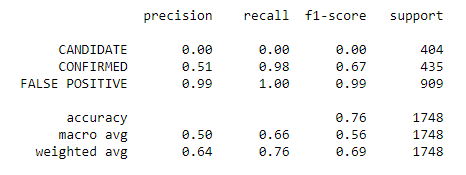
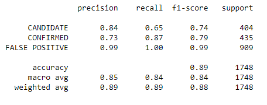

# Machine Learning Challenge!
#### In this challenge, I'll create machine learning models capable of classifying candidate exoplanets from a dataset based on certain features.
###### Rodrigo Lozano - 2020
-----

## Background:
Over a period of nine years, the NASA Kepler space telescope has been out to discover hidden planets outside our solar system: exoplanets.
This mission produced a dataset that tells us which discoveries have been actually exoplanets and which discoveries have been false positives.

To help process the data, I'll create machine learning models that can classify discoveries made by the Kepler space telescope.

## Approach:
1. Preprocess the raw data.
2. Create model.
3. Tune the model.

These steps will be followed for each of the models created.

## First steps:
Before I begin with the modeling, though, I'd like to first discover what the most important features of the dataset are. This way, less resources will be invested in features that don't really contribute to the model.
To do this, I ran both a Decision Tree and a Random Forest.

Their respective scores were:
* Decision Tree: .864
* Random Forest: .911

From them, I determined that the features of most importance were:
* "koi_fpflag_co"
* "koi_fpflag_nt"
* "koi_fpflag_ss"
* "koi_model_snr"
* "koi_fpflag_ec"
* "koi_prad"
* "koi_prad_err2"

With this out of the way, we can now begin.

## Model Performance

###SVC

We can see that the model has an accuracy of .76 and, because of the scaling, it found no way to learn how to predict if a finding is a Candidate or not. Therefore, this model doesn't really work for us.

###KNN

The model ended up having an accuracy of .89, immeadiately better than the SVC model. Candidate findings are correctly predicted 84% of the times, so I'd say that between both models that were tested, this one is the way to go.

